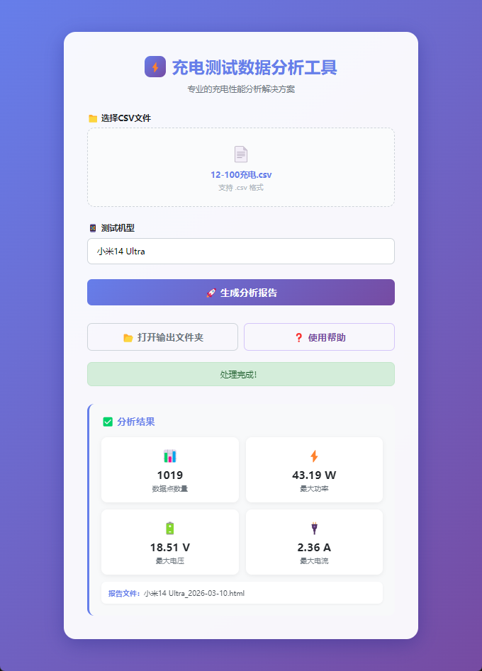
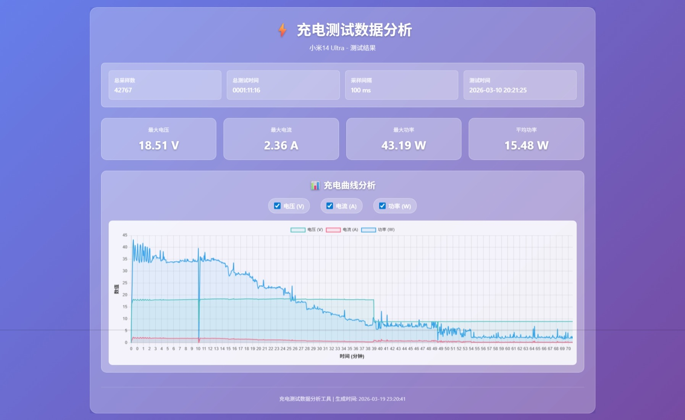

# WITRN Charge Analyzer

基于维简K2 USB电流表的充电数据分析工具，将WITRN V3.1上位机导出的CSV数据转换为美观的交互式HTML报告。

  

## 功能

- 解析维简K2电流表CSV数据（电压、电流、功率、温度）
- 生成交互式Chart.js图表，支持曲线显示/隐藏
- 数据自动降采样，保证大文件流畅渲染
- 一键打包为独立安装程序，无需Python环境

## 项目结构

```
├── charge_analyzer.py       # 数据分析核心脚本
├── main.js                  # Electron主进程
├── electron-index.html      # 前端界面
├── package.json             # 项目配置
├── package-lock.json        # 依赖锁定
├── icon.ico                 # 应用图标
├── screenshots/             # 截图
│   ├── app.png              # 主界面
│   ├── result.png           # 分析结果
│   └── report.png           # HTML报告
├── 12-100充电.csv           # 示例数据
├── LICENSE
└── README.md
```

## 预览





## 快速开始

### 下载安装

前往 [Releases](../../releases) 下载最新版本安装程序。

### 从源码运行

```bash
# 克隆项目
git clone https://github.com/yourname/charge-analyzer.git
cd charge-analyzer

# 安装依赖
npm install

# 运行
npm start
```

## 使用方法

1. 打开WITRN V3.1上位机，使用维简K2记录充电数据
2. 导出CSV文件
3. 启动本工具，选择CSV文件
4. 输入测试机型名称
5. 点击「生成分析报告」

报告会保存在CSV文件同目录下，格式为 `{机型}_{日期}.html`。

## CSV格式说明

本工具支持WITRN V3.1导出的标准CSV格式：

```
SUM,42767
TotalTime,0001:11:16
SampTime(ms),100
DateTime, 2026-03-10 20:21:25
Time(hh:mm:ss:ms),Voltage(V),Current(A),Power(W),Temperature
"00:00:00:000", 0.000, 0.000, 0.000,--
"00:00:00:100", 15.19, -0.37, 5.652,--
...
```

## 常见问题

**Q: 为什么安装包这么大？**

安装包约100MB+，主要因为内置了：
- **Chromium** - Electron应用的渲染引擎，用于显示Chart.js图表
- **Python运行时** - 数据分析核心逻辑由Python实现

这是Electron应用的通病，优点是用户无需安装任何环境，开箱即用。如果你有Python和Node.js环境，也可以下载源码直接运行，体积更小。

## 技术栈

- **前端**: Electron + Chart.js
- **数据处理**: Python
- **打包**: electron-builder + PyInstaller

## 相关链接

- [维简K2](https://www.witrn.com/) - USB电流表硬件
- WITRN V3.1 - 配套上位机软件

## License

MIT

## 免责声明

本工具仅供学习和个人测试使用。使用本工具分析的数据仅供参考，不作为任何商业或专业用途的依据。作者不对使用本工具可能造成的任何损失承担责任。

本项目与维简科技（WITRN）无官方关联，为社区用户自发开发的第三方工具。

## 反馈与贡献

如果你在使用过程中遇到问题或有改进建议，欢迎：

- 提交 [Issue](../../issues) 反馈问题
- 提交 [Pull Request](../../pulls) 贡献代码
- Star 本项目表示支持

感谢你的使用和反馈！
